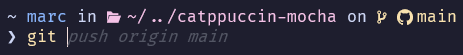

# Catppuccin Mocha

Catppuccin Mocha is a theme for **[Oh My Posh](https://ohmyposh.dev/)** with _Git_ integration.



## Installation

First you have to install `oh-my-posh`. Please follow the [Oh My Posh documentation](https://ohmyposh.dev/docs/) for all the steps. Now you can use all the [themes](https://ohmyposh.dev/docs/installation/customize).

You can directly use Catppuccin Mocha without downloading anything by pointing to the GitHub URL:

```pwsh
oh-my-posh init pwsh --config "https://raw.githubusercontent.com/galgardev/catppuccin-mocha/main/catppuccin-mocha.omp.json" | Invoke-Expression
```

This way it will always be updated up to the latest version uploaded. Otherwise, you can just [download it from the releases](https://github.com/galgardev/catppuccin-mocha/releases/) and drop it into your desired folder. Please, make sure to have a [Nerd Font](https://www.nerdfonts.com/font-downloads) **3.0.0 or above** installed.

## License

This theme is distributed under [MIT License](LICENSE). If you use my code extensively I would greatly appreciate if you could credit my GitHub profile [`https://github.com/galgardev`](https://github.com/galgardev). Thank you!
